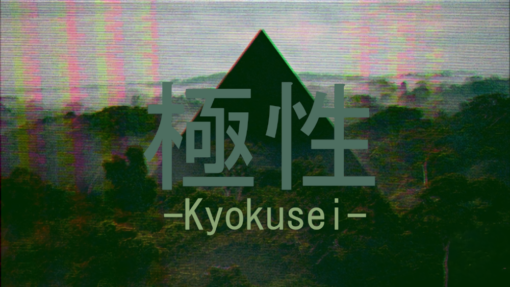

= 極性 -Kyokusei-

'''
// image:https://forthebadge.com/images/badges/made-with-c.svg["Made with C"]

image:https://img.shields.io/gitlab/pipeline/aurumcodex/kyokusei.svg?logo=gitlab&label=pipeline&logoColor=blueviolet&style=for-the-badge[Gitlab pipeline status]
image:https://img.shields.io/discord/564447217180606484.svg?color=7289da&label=discord&logo=discord&logoColor=dddddd&style=for-the-badge[Discord]

A GBA homebrew game.
Target Date: 11.28.2019.

This project is possibly going to be rewritten in Rust, depending on circumstances.

// image::gplv3.png[] 
// image::alt_gplv3.png["GPLv3",100,40,align="right",LICENSE]

== License
This project is licensed under the link:LICENSE[MIT license].

Kyokusei is based in part on the work of the devkitpro project (http://sourceforge.net/projects/devkitpro).

++++

++++